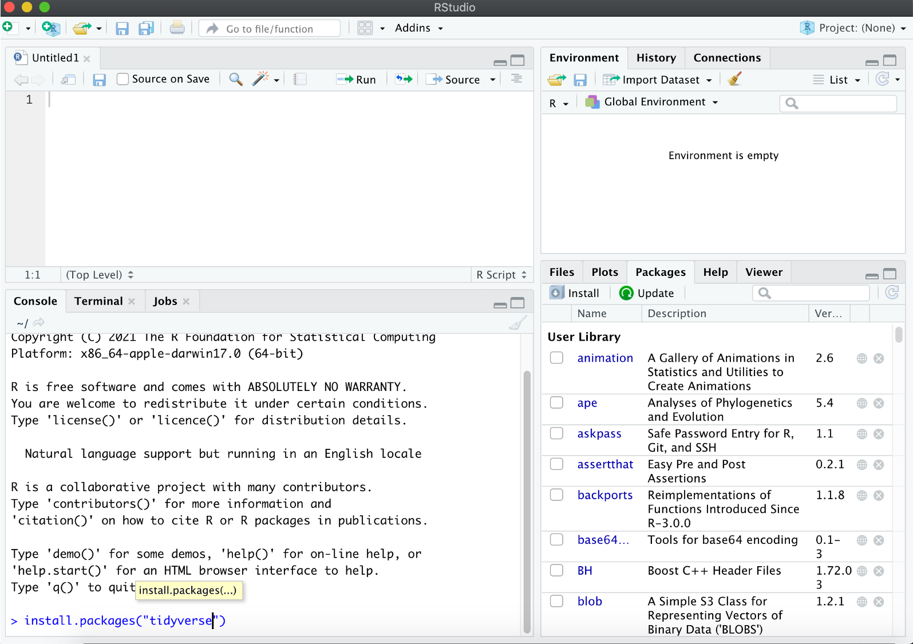
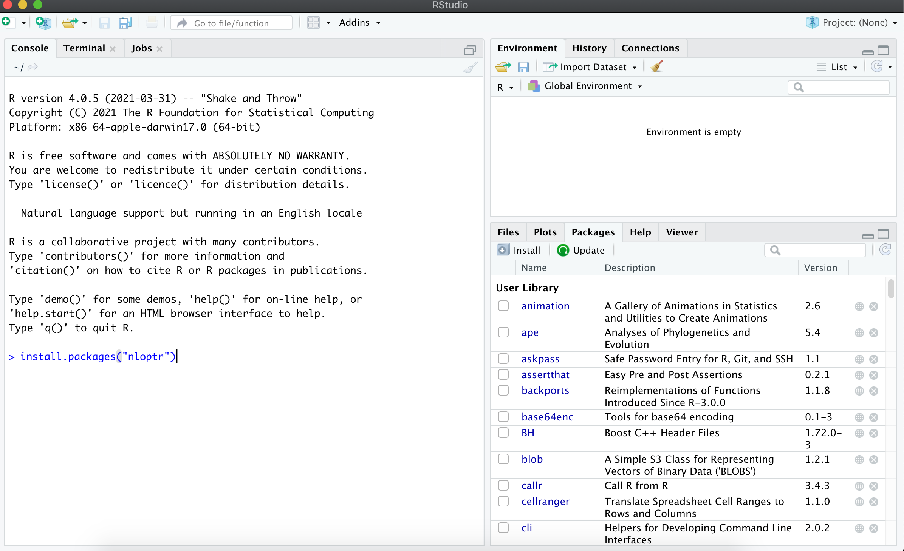
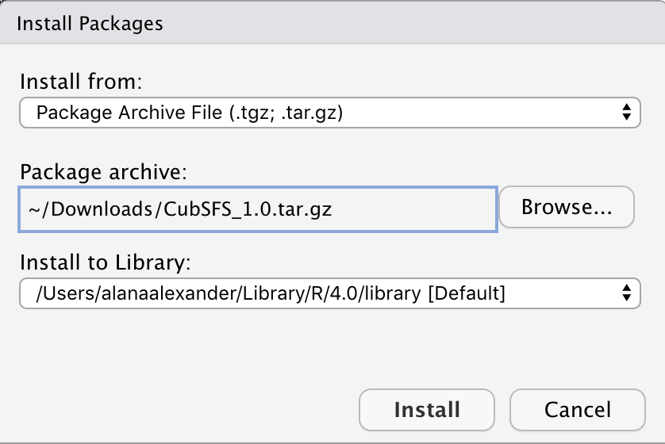
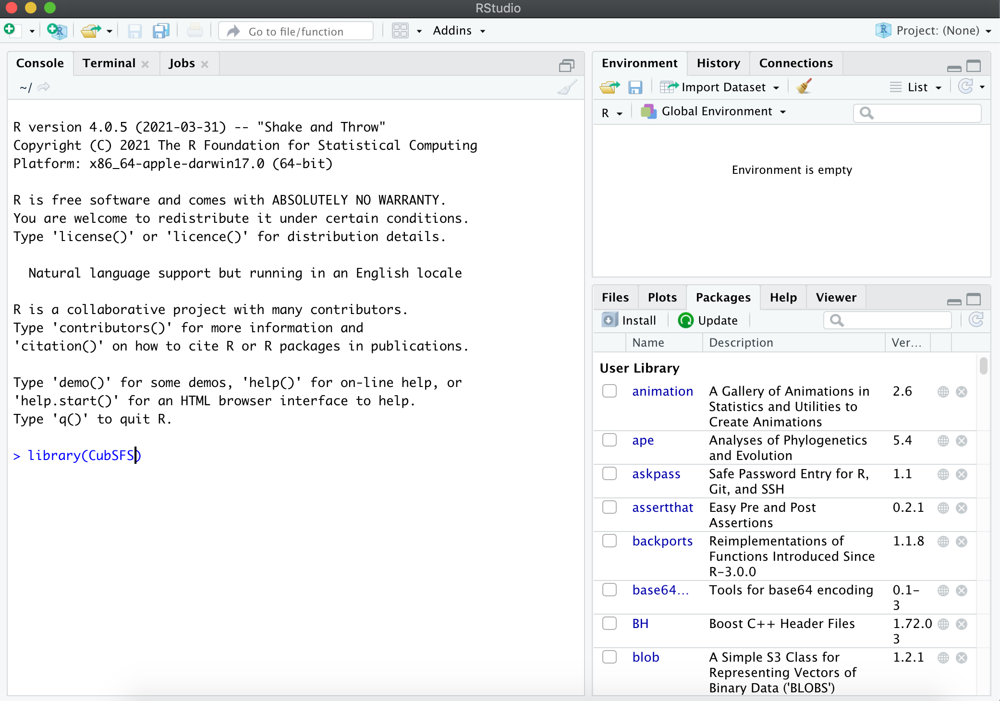

## 1. Getting Started
Welcome to our workshop on using `CubSFS` to generate a demographic reconstruction based on an SFS (allele/site frequency spectrum). Alana will give you [a brief spiel](../Data_Scripts/What_the_heck_is_an_SFS.pdf) about what a SFS is and a general description of how this analysis works in just a sec, but first, let's download `R` and `R Studio`, and install `tidyverse` so the installation can proceed while she's prattling on (if these are not already installed on your computer).  

### A) Installing R
First off, we need to install `R` (if it isn't already on your computer). After heading to 
https://cran.rstudio.com/
select your operating system, download, and install `R` however you install things on your operating system.

### B) Downloading R Studio
Although we could run our code directly in `R`, `R Studio` is a neat little GUI that allows you to save the code that you are writing for later reuse. Download `R Studio` (if it isn't already on your computer) at: [https://www.rstudio.com/products/rstudio/download/](https://www.rstudio.com/products/rstudio/download/)  

Download the `RStudio Desktop Open Source License` version that matches your operating system (note, it can be quite a big download e.g. 150MB!), and then install `R Studio` however you install things on your operating system.

### C) Installing the tidyverse packages
For "pretty plotting" purposes, we are next going to install the `tidyverse` package (if it isn't already installed on your computer). After opening `R Studio`, into the main console window, type:
`install.packages("tidyverse")` 

If you are prompted to install any of the dependent packages from source, `no` is the quickest option.  

### D) Downloading the CubSFS package
Our next step is to download the `CubSFS` package. This package has additional functions that we'll use to do our demographic reconstructions. Head to
https://github.com/blwaltoft/CubSFS/blob/master/CubSFS_1.0.tar.gz
and click on the `Download` button

### E) Installing the CubSFS package
First up, we need to install *another* package that `CubSFS` needs in order to function, `nloptr`. Into the main `R studio` console window, type:
`install.packages("nloptr")`


Now we are ready to install `CubSFS`. To do this, in `R studio`:  
    - Go to `Tools`.  
    - Go to `Install Packages`.  
    - In the `Install From` drop down menu select `Package Archive File (.zip; .tar.gz)`  
    - Browse your way to the `CubSFS_1.0.tar.gz` file (note, you don't need to `untar` it...also don't worry if you don't know what `untar` means!). Your `Install to Library` (and potentially `Package archive`) drop down menus will look different to mine.  
  
    - Click on `Install`

We are ready to load all the functions included in the `CubSFS` package into this `R studio` session so they are available for us to use (installing the package is like buying a book and putting it on a shelf, loading the package is like getting the book out to read). Keeping with the book analogy, the command for loading in the package is:
`library(CubSFS)`


### F) Loading the tidyverse and parallel packages
We'll go ahead and load the `tidyverse` and `parallel` packages, using the same `library` command. We didn't need to install the `parallel` package when we installed the other packages, as it is installed as part of base `R`:
```
library(tidyverse)
library(parallel)
```

### G) Sourcing modified CubSFS functions
A few of the functions available in `CubSFS` need to be tweaked slightly from the original version. We need to download and source new versions of the following four functions: `AicCubSFS.R`, `CValpha.R`, `estimateAlpha.R`, and `estimateCubSFS.R`:
```
download.file("https://raw.githubusercontent.com/laninsky/SFS_workshop/main/Data_Scripts/AicCubSFS.R","AicCubSFS.R")
source("AicCubSFS.R")

download.file("https://raw.githubusercontent.com/laninsky/SFS_workshop/main/Data_Scripts/CValpha.R","CValpha.R")
source("CValpha.R")

download.file("https://raw.githubusercontent.com/laninsky/SFS_workshop/main/Data_Scripts/estimateAlpha.R","estimateAlpha.R")
source("estimateAlpha.R")

download.file("https://raw.githubusercontent.com/laninsky/SFS_workshop/main/Data_Scripts/estimateCubSFS.R","estimateCubSFS.R")
source("estimateCubSFS.R")
```
Finally, we are ready to go! Let's head to the [instructions for running CubSFS](../2_Running_CubSFS/README.Md)
