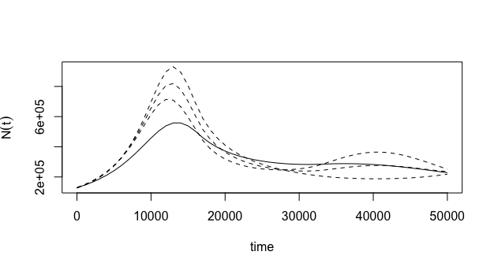
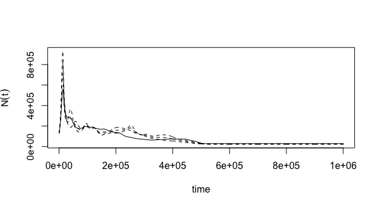

## Running CubSFS
If you've jumped straight to this section, please make sure that you've got `R` and `R studio` installed, as well as loading the packages `tidyverse`, `parallel`, and `CubSFS` (see [1_Getting_Started](../1_Getting_Started/README.Md) for instructions on installing `cubSFS`). 
```
library(tidyverse)
library(CubSFS)
library(parallel)
```
Every time you restart `R studio`/load `cubSFS`, you'll also need to source the modified `cubSFS` code (*after* you've loaded the `cubSFS` package, or the versions of the code in the package will replace those that you've sourced!) from wherever you downloaded it e.g.
```
source("AicCubSFS.R")
source("CValpha.R")
source("estimateAlpha.R")
source("estimateCubSFS.R")
```

### A) Downloading the SFS file
```
download.file("https://raw.githubusercontent.com/laninsky/SFS_workshop/main/Data_Scripts/NZ_Gaus_pop1_MAFpop0.obs","lamprey_sfs.txt")
```

### B) Loading the SFS file in
```
# Reading in the file, skipping the first line
obsSFS <- read_table2("lamprey_sfs.txt",skip = 1)

# Converting the file to a matrix
obsSFS <- as.matrix(obsSFS)[1,]

# Rounding the entries as CubSFS can have problems with decimals
obsSFS <- round(obsSFS,digits=0)
```

### C) Obtaining a few parameters we'll need from the SFS file
```
# Although our data is a folded SFS, the input program still 
# has the "back half" of the SFS, but with 0s as entries. This 
# means that the length of this SFS is equal to 2N samples,
# which is what CubSFS wants as a value for n.samples
n.samples <- length(obsSFS)

# We need the total number of sites in our SFS to convert our 
# relative demographic reconstruction into absolute time
total.nb.sites <- sum(obsSFS)

# Now we've recorded the total number of sites in our SFS, we
# remove the monomorphic sites, as these are not used for
# estimating the relative demography of the population
obsSFS <- obsSFS[-1]

# As this is a folded SFS, we now remove the empty entries for 
# our analyses so that CubSFS doesn't get confused
obsSFS <- obsSFS[1:(length(obsSFS)/2)]
```

### D) Setting some parameters for the analysis
```
# mutation rate in sites/gen
mu <- 5e-08

# generation time per year
genyr <- 8

# the number of time points the reconstruction will be sliced up into
time_points <- 29

# oldest time point in coalescent units (1 coalescent unit = 2Ne generations)
oldest_time <- 0.25

#Set the number of cores (use detectCores to use all)
numcores <- detectCores()
```

### E) Running CubSFS
After all that, running CubSFS is relatively easy. Expect it to take about 5-7 minutes or so. In the meantime, you can check out the expected outputs below and after your run finishes, confirm you got similar results (there will be run to run variation).
```
cubsfs_results <- estimateCubSFS(obsSFS,n.samples,n.knots=time_points,t_m=oldest_time,is.folded=TRUE)
```

### F) Having a look at some of the plots for QC purposes
```
cubsfs_results$CoalRatePlot
```  
Coalescent rates through time  

    
```

cubsfs_results$SFSPlot
```
A comparison of the observed (red dots) versus expected (line) counts in the SFS
  

```

cubsfs_results$qqPlot
```
A qqplot of expected (dashed line) and observed (red dot) counts in the SFS. Dots sitting on the line = good fit!

  

### G) Converting coalescent rate into population size through time

```
# Plotting focussing on time scales relevant to the Last Glacial Maximum (LGM)
TimeInYears <- seq(0,50000,by=1000)
last_50k <- PlotCubSFS(n.samples,mu,total.nb.sites,genyr,cubsfs_results, abstime=TimeInYears, is.folded = TRUE)
```
 

```
# Plotting deeper time
TimeInYears <- seq(0,1000000,by=1000)
last_million <- PlotCubSFS(n.samples,mu,total.nb.sites,genyr,cubsfs_results, abstime=TimeInYears,is.folded = TRUE)
```
 

### H) Check the placement of the knots in time (relative to the Last Glacial Maximum: LGM)
Before we move on to bootstrapping to give us some idea of the uncertainty in our population estimates, we need to make sure that our time 'knots' are placed informatively for population changes through the last LGM (approx 15-30 kya). To convert those knots to "real time", we need to multiply them by 2 * Ne * generation time. We take the Ne from the estimated `Nt` at time 0 from our results.
```
2 * last_50k$Ntdf[1,2] * genyr * cubsfs_results$knots
```
Cool! We've got a few points that are informative in respect to the LGM (e.g. a couple younger, a couple older), so can feel reasonably confident the increase in apparent effective population size we see around the LGM is legit (but remember there are other things that can confound estimation of Ne, including population structure).
```
# Knot placement in years
0.00  16534.00  33200.29  49999.93  66933.99  84003.54 101209.67 118553.47 136036.04 153658.50 171421.95 189327.54 207376.40 225569.66 243908.50 262394.07 281027.55 299810.12 318742.97 337827.31 357064.35 376455.31 396001.42 415703.92 435564.07 455583.13 475762.36 496103.05 516606.49
```
Note, also, that for this run, we aren't explicitly estimating Ne for any time point beyond 516,606.49 years ago (the oldest knot). You'll notice the reconstruction somewhat 'flat lines' beyond this point in the past in our `last_million` effective population size reconstruction.

### I) Run some bootstraps for estimating uncertainty
In "real life", the more bootstraps the better, but as they can take 5-10 min each, today we are just going to do two. In the meantime while yours are running, feel free to check out the plots in the next section
```
# Defining the number of bootstraps
nb.boot <- 2

# Creating the object with bootstrapped SFS
boot <- rmultinom(nb.boot,total.nb.sites,c(total.nb.sites-sum(obsSFS),obsSFS)/total.nb.sites)
# Stripping the monomorphic sites out of the bootstrapped SFS
boot <- boot[-1,]

# Creating an object to record the results
boot.res <- list()

# Running the first bootstrap
boot.res[[1]] <- estimateCubSFS(boot[,1],n.samples=n.samples,n.knots=time_points,t_m=oldest_time,is.folded=TRUE)

# Running the second bootstrap
boot.res[[2]] <- estimateCubSFS(boot[,2],n.samples=n.samples,n.knots=time_points,t_m=oldest_time,is.folded=TRUE)

# Some boots can cause the optimisation to hang, potentially because
# of https://github.com/facebook/prophet/issues/842. If this occurs
# kill the run, and restart it.
```

### J) Generating the bootstrap results in "real time"
We use code very similar to plotting our original SFS data. Note, given our limited number of bootstrap replicates, these may not span our actual estimate.
```
# Plotting the the last 50kya (relevant to the LGM)
TimeInYears <- seq(0,50000,by=1000)
last_50k <- PlotCubSFS(n.samples,mu,total.nb.sites,genyr,cubsfs_results,boot.res=boot.res, abstime=TimeInYears, is.folded = TRUE)
```
  

```
# Plotting deeper time
TimeInYears <- seq(0,1000000,by=1000)
last_million <- PlotCubSFS(n.samples,mu,total.nb.sites,genyr,cubsfs_results,boot.res=boot.res, abstime=TimeInYears, is.folded = TRUE)
```


For your own projects, it is worth writing out the cubsfs_results and boot.res objects in case you want to compare AIC values between different numbers of knots/oldest knot time values to optimize the choices around these (and so you don't need to run CubSFS again for a given combination of parameters!). Next up, [plotting these prettily using ggplot2](../3_Plotting_with_tidyverse/README.Md).
